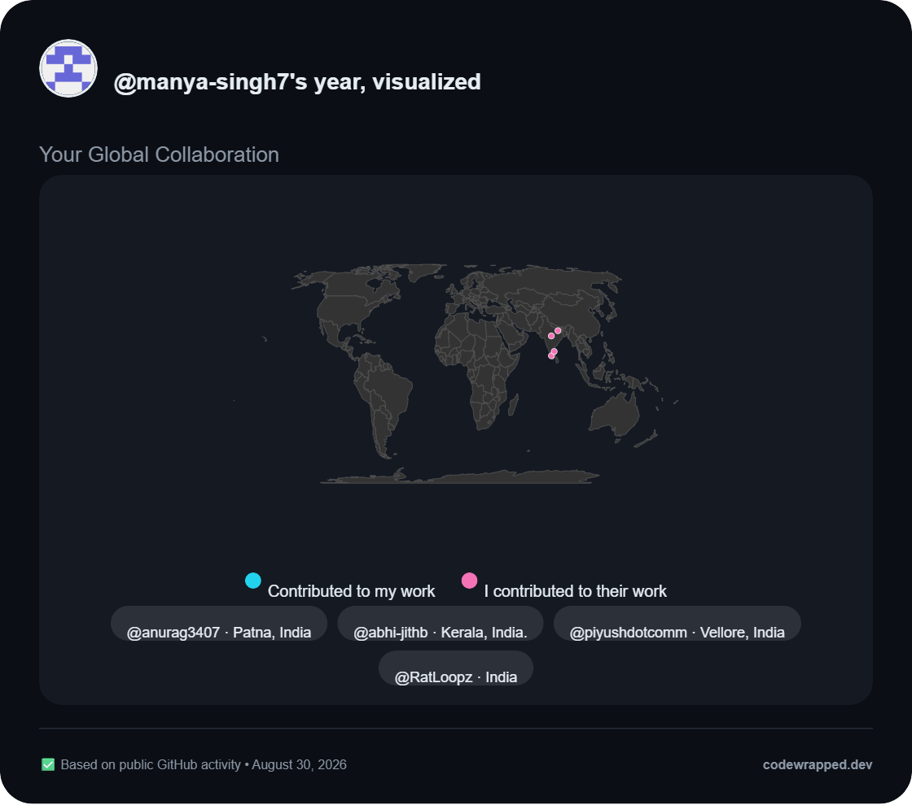
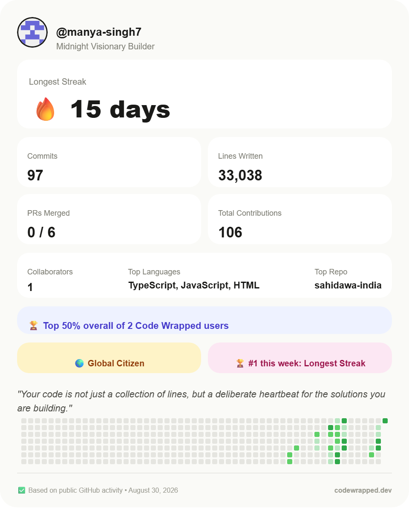

# Code Wrapped 🎁

A personalized, narrated retrospective of your GitHub activity, for whatever window of time you actually want, not just a fixed calendar year. Built like a Spotify Wrapped for your commit history.

Live: [mycodewrapped.vercel.app](https://mycodewrapped.vercel.app)

<table>
  <tr>
    <td width="50%"></td>
    <td width="50%"></td>
  </tr>
</table>

## What it is

You sign in with GitHub and it pulls your real commit history, PRs, issues, and collaboration data and turns it into a scroll based story of your year. There's an AI written narrative, a GitHub style contribution heatmap, a repo leaderboard, achievement badges, and a world map showing everyone you've worked with. You can pick any time range, compare yourself against a friend, and download a shareable card at the end.

I started this because every "GitHub Wrapped" tool I found online just showed the same three stats everyone else's did (commits, top language, a streak number) and called it a day. I wanted something that actually looked at collaboration, told you something specific about your year instead of a generic summary, and didn't fake numbers it didn't have data for.

### Features

- AI generated story, roast, hype line, quote, and developer archetype, built from your actual stats plus short context pulled from your repo READMEs
- Repo Hall of Fame, a podium that ranks your repos using stars, forks, commits, and real collaboration instead of just star count
- World map of collaborators, in both directions (people who contributed to your repos, and repos you contributed to). If someone hasn't set a location on GitHub, it falls back to reading their bio, then their profile README, using an LLM to pull out a real place name
- Coding Chapters, your year auto split into eras with AI written titles based on what you were actually building in each stretch
- Secret achievements and a weekly spotlight leaderboard across rotating categories
- A real percentile score, ranked against other Code Wrapped users across seven metrics. It shows nothing until there are enough users to make the comparison mean something
- Public profile pages (`/u/username`) that don't require the visitor to sign in
- Head to head comparison against any public GitHub username
- Two downloadable share cards, one for stats and one for the heatmap and world map, both exportable as PNG

## Stack

| Layer | Technology |
|---|---|
| Framework | Next.js (App Router) |
| UI | React, Tailwind CSS, Framer Motion |
| Auth | NextAuth.js (Auth.js) v5, GitHub OAuth |
| Database | Supabase (PostgreSQL) |
| AI | Google Gemini API |
| Data viz | Recharts, react-simple-maps |
| Image export | html2canvas |
| Deployment | Vercel |

## How it's built

The main page is a React Server Component. All GitHub API calls, Supabase queries, and Gemini calls happen server side on request, before a single byte of HTML reaches the browser. Nothing about the data pipeline runs client side; the client only handles animation, the date range picker, and the two canvas exports.

**Caching strategy.** AI generated content, coding chapters, and the underlying stat snapshot are cached in Supabase, keyed by `github_username + period`. On each request, the cache is checked against a `commit_count_snapshot`; if the count matches, the cached row is served and GitHub is never touched for that data. If it's stale, the old row is deleted and a fresh one generated. This means a user who hasn't committed since their last visit gets a near instant load with zero new API calls, while a user who has gets fully fresh data automatically, with no manual invalidation.

**Read path for public profiles is fully decoupled from the live GitHub API.** `/u/[username]` reads only from the cached Supabase row. It never calls GitHub, never needs the visitor to be authenticated, and never depends on the profile owner being online. This was a deliberate split: the authenticated path optimizes for freshness, the public path optimizes for speed and availability.

**Concurrency.** Independent I/O is parallelized with `Promise.all` rather than awaited sequentially. Commit, PR, and issue data fetch concurrently; AI story generation and chapter generation (two separate Gemini calls) run concurrently; incoming and outgoing collaborator location lookups run concurrently. Fetching per commit line diffs (additions and deletions per commit, needed for the "lines written" stat) is also parallelized across all commits in a repo rather than looped sequentially, since GitHub rate limits are per token, not per request in flight.

**Data modeling for the collaboration graph.** Collaboration is tracked bidirectionally rather than treating the signed in user as the only subject. For every repo the user owns, the app checks who else has committed to it. For every repo the user has forked, it checks whether the user has personally committed to it (versus just holding an untouched fork), and if so, resolves the fork's `parent` field via a second API call to find the true upstream owner, since GitHub's repo list endpoint reports the fork itself as owned by the current user, not the original author.

**Composite ranking instead of naive sorting.** Both the Repo Hall of Fame and the cross user percentile score use normalized, weighted composites rather than sorting on a single column. Repos are scored on stars, forks, and commit volume, each normalized against the user's own maximum so no single large number dominates, plus a collaboration bonus. The percentile score normalizes seven metrics (streak, commits, lines written, collaborators, repos, stars, and total contributions) against the full user base, sums them into one score per user, and ranks by that score, so the resulting percentile is always a real position in a real ordering, never an average of independent probabilities that can produce a number nobody actually holds.

## Bugs I actually had to think about

**Streak counting was wrong for anyone outside UTC.** GitHub gives you commit timestamps in UTC with no local offset attached. If you commit at 12:30am IST, that's still "yesterday" in UTC, so a naive day boundary check would break your streak on a commit that, to you, happened the same night. Fixed by detecting the visitor's timezone client side and using `Intl.DateTimeFormat` to bucket every commit into the correct local day before counting anything.

**Ranking repos by stars alone felt hollow.** Most people don't have many stars, and a stars only leaderboard would just show whichever repo got lucky once. The Hall of Fame score normalizes stars, forks, and commit count against your own max, then adds a real collaboration bonus, checked both directions, whether someone contributed to your repo, or whether you personally committed to something you forked.

**Most GitHub profiles don't have a location set.** So the world map would be nearly empty for most people. It checks the location field first, then the bio, then falls back to reading the person's pinned profile README and asking an LLM to pull a real, geocodable city out of it if one's mentioned. Locations that came from that inference are shown with a slightly different marker so it's clear they weren't stated directly.

**Caching quietly broke and started duplicating rows.** The original cache check assumed `github_username + period` was always a unique key and used Supabase's `.maybeSingle()`, which throws rather than returning null the moment more than one row matches. Once two rows existed for the same key (most likely from two page loads racing each other before the first one's cleanup finished), every subsequent read threw silently, the "delete the stale row before inserting" step never ran, and the table grew to over four hundred duplicate rows for a single user and period before it surfaced as a UI bug (stale data on the public profile) rather than a visible error. Fixed by treating the query as "most recent matching row, if any" instead of assuming uniqueness, and making the delete step unconditional rather than gated on the read having succeeded, so the two failure modes can't compound each other again.

## Honest limitations

Only public GitHub activity is visible. If someone does most of their real work in private repos, their streak and totals here will undercount, and there's no way around that without them explicitly granting broader access.

Percentiles and the weekly leaderboard only mean something once there's a real user base to compare against. Right now that's a handful of people, so those numbers are accurate but not yet interesting. The app shows nothing rather than a made up percentage when the sample is too small to say anything real.

## What's next

Streak risk email reminders are in progress: a scheduled job that checks who's about to lose a streak and nudges them before midnight in their timezone. This needs its own infrastructure the rest of the app doesn't currently have (a background job that runs independent of anyone visiting the site, and safe long term storage of a GitHub token so it can check on someone's behalf while they're not there), so it's being built as its own piece rather than bolted onto the existing request/response flow.

## Running it locally

```bash
git clone https://github.com/manya-singh7/code-wrapped.git
cd code-wrapped
npm install --legacy-peer-deps
```

You'll need a `.env.local` with:

```
AUTH_GITHUB_ID=
AUTH_GITHUB_SECRET=
AUTH_SECRET=
GEMINI_API_KEY=
NEXT_PUBLIC_SUPABASE_URL=
NEXT_PUBLIC_SUPABASE_ANON_KEY=
```

That means a GitHub OAuth app for the client id and secret, a Supabase project with `wrapped_cache`, `chapters_cache`, `weekly_spotlight`, and `user_locations` tables, and a Gemini API key.

```bash
npm run dev
```

## Built by

[Manya Singh](https://github.com/manya-singh7)
